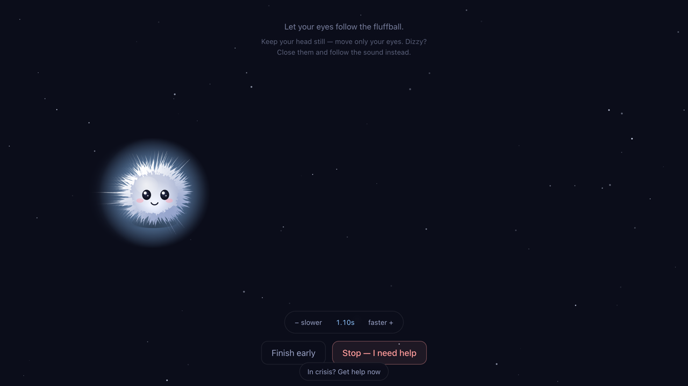
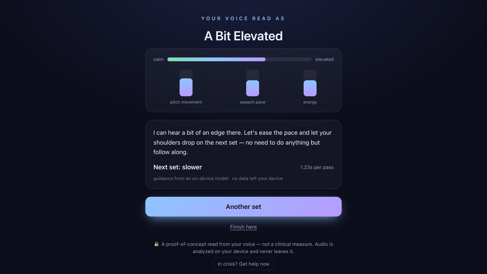
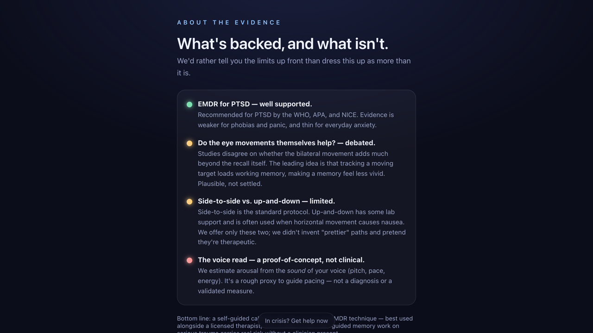
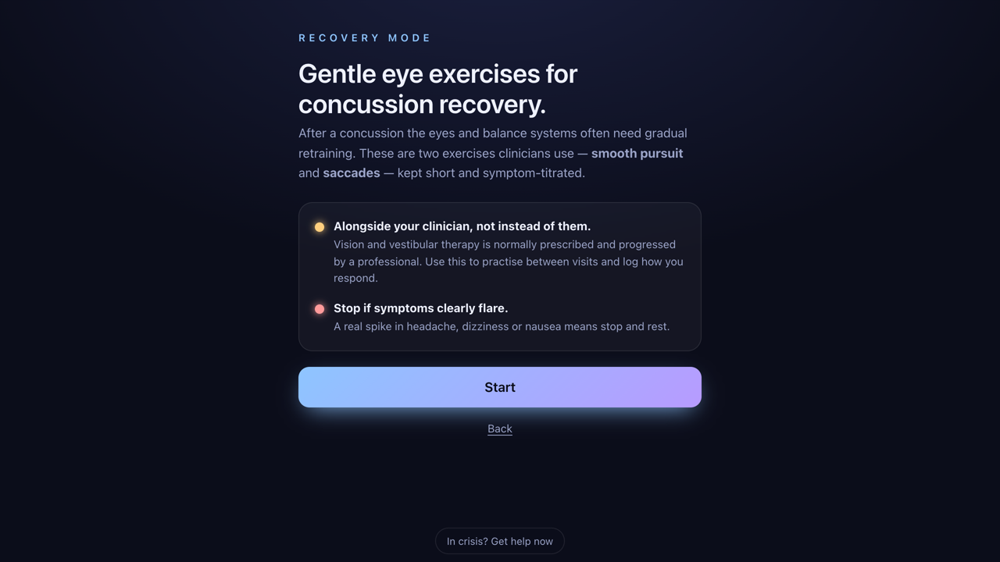

# Lenis

**A voice-guided calming companion.** Lenis leads you through gentle,
EMDR-style *bilateral stimulation* — a soft target that eases side to side while
your eyes follow — and adapts the pace to **the sound of your voice**, not a
slider you drag. It runs entirely in your browser: no account, no server, and
your audio never leaves your device.

> _Lenis_ is Latin for "soft, gentle, calming."

Built for **Hack for Humanity — Summer 2026** (AI for mental & physical health).

<p align="center">
  
</p>
<p align="center"><em>Follow the fluffball. It drifts to the pace your voice sets.</em></p>

<table>
  <tr>
    <td align="center"><strong>It reads your voice</strong></td>
    <td align="center"><strong>Honest about the evidence</strong></td>
    <td align="center"><strong>Concussion recovery mode</strong></td>
  </tr>
  <tr>
    <td></td>
    <td></td>
    <td></td>
  </tr>
</table>

---

## The problem

Self-guided EMDR / bilateral-stimulation apps are everywhere, but they all run on
**self-report**: you tap a 0–10 distress slider and the app adjusts. Two gaps:

1. **Nobody reads the body.** A number you type is not how activated you actually
   are. The voice often tells a different story than the slider.
2. **No readiness check.** Most apps let you jump straight into a distressing
   memory on screen one — the opposite of how a clinician would pace it.

## What Lenis does differently

- **🎙️ Vocal-adaptive pacing.** Between sets you speak for a few seconds. Lenis
  analyses the *sound* of your voice on-device — pitch variability, speech pace,
  energy — into a rough arousal proxy, and sets the next set's speed from that.
  Talk keyed-up, and the target visibly slows down.
- **🧠 On-device coaching, no API key.** A free, in-browser transcript (Web
  Speech API) plus a rule-based coach turns the check-in into a short, warm
  spoken prompt and a pace decision — and flags crisis language to route you to
  help. Nothing is sent to a cloud model.
- **🛟 Safety as a feature.** Consent gate, always-visible crisis resources, a
  live "slower / stop" control, "close your eyes and follow the sound" guidance
  for dizziness, and a **self-report-vs-voice** comparison so you can see when
  your words and your body disagree.
- **📊 Honesty on purpose.** A built-in **"About the evidence"** screen lays out,
  in plain language, what's well-supported (EMDR for PTSD), what's debated (the
  eye movements themselves), and what's just a proof-of-concept (the voice read).
- **🧠 Concussion recovery mode.** The same smooth-pursuit engine powers
  clinician-aligned oculomotor exercises — smooth pursuit and saccades — with a
  symptom check before and after and a summary to bring to your clinician.
  Symptom-titrated: a little challenge is fine, a real flare is your cue to stop.

## Responsible-AI stance

Lenis is a **self-help calming aid, not therapy and not a medical device.** It is
*not* guided trauma processing — full EMDR should be done with a licensed
therapist. The vocal signal is a **proof-of-concept proxy, not a clinical
measure.** Everything runs client-side; no audio, transcript, or data is
uploaded or persisted. Best used *alongside* professional care, not instead of it.

## How it's built

- **React + Vite + TypeScript**, single-page, a small state machine
  (welcome → evidence → setup → session → check-in → close).
- **Bilateral-stimulation engine** (`src/bls.ts`): canvas animation with eased
  motion, stereo-panned Web Audio tones, and haptic taps.
- **Voice analysis** (`src/voice.ts`): [Pitchy](https://github.com/ianprime0509/pitchy)
  for pitch + [Meyda](https://meyda.js.org/) for energy → arousal proxy. Includes
  a headless, self-testable path (`analyzeSamples` / `synthClip`).
- **On-device reasoning** (`src/coach.ts` + `src/transcribe.ts`): free Web Speech
  transcription + a rule engine. Designed behind a small `Guidance` interface so
  a hosted model (e.g. Claude) can be dropped in later without UI changes.
- **No backend, no auth, no persistence.** Deployed as a static site on Render.

## Run it locally

```bash
npm install
npm run dev
```

Then open the local URL. For the microphone features, use **Chrome or Edge**
(Web Speech API); elsewhere the app still runs and simply falls back to the
vocal signal without a transcript.

```bash
npm run build   # production build → dist/
```

## Credits

Built by **patkusch** for Hack for Humanity, Summer 2026.
